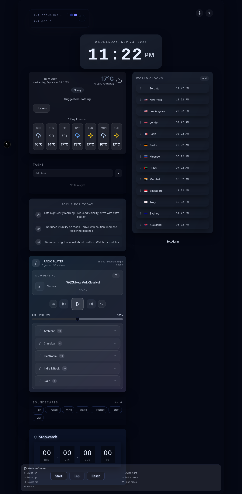

# 🕐 Modern Alarm Clock

A sophisticated, feature-rich alarm clock application built with Next.js 15, featuring dynamic theming, neumorphic design, and comprehensive time management capabilities.



## ✨ Features

### 🎨 **Dynamic Theme System**
- **Time-Based Themes**: Automatically changes themes based on time of day
  - 🌙 **Midnight Dreams** (00:00-05:00) - Deep blues and purples
  - 🌅 **Aurora Dawn** (05:00-07:00) - Warm oranges and pinks
  - ☀️ **Morning Light** (07:00-12:00) - Fresh blues and cyans
  - 🌞 **Golden Hour** (12:00-17:00) - Bright yellows and ambers
  - 🌆 **Sunset Glow** (17:00-20:00) - Rich oranges and magentas
  - 🌃 **Deep Night** (20:00-00:00) - Calm grays and slate
- **Manual Theme Toggle**: Switch between light and dark modes
- **Neumorphic Design**: Modern soft UI with sophisticated shadow patterns
- **Glassmorphism Effects**: Backdrop blur with theme-aware gradients

### ⏰ **Advanced Clock Features**
- **Smooth Number Transitions**: Elegant digit animations using Framer Motion
- **Multiple Time Formats**: Toggle between 12-hour and 24-hour formats
- **Optional Seconds Display**: Show/hide seconds with animated transitions
- **Gesture Controls**: Touch-friendly swipe gestures for mobile devices
- **World Clock Support**: Add multiple time zones with country flags

### 📻 **Premium Radio Player**
- **60+ Working Stations**: Curated collection of high-quality radio streams
- **Genre Categories**: Classical, Jazz, Ambient, Electronic, World Music, Alternative
- **Advanced Controls**: Play/pause, previous/next, shuffle, repeat modes
- **Connection Status**: Real-time feedback on stream connectivity
- **Favorites System**: Heart your favorite stations
- **Volume Control**: Smooth slider with percentage display
- **Error Handling**: Graceful failure with user notifications

### 🌤️ **Weather Integration**
- **Current Conditions**: Temperature, humidity, wind speed
- **5-Day Forecast**: Extended weather predictions
- **Clothing Suggestions**: Smart recommendations based on weather
- **Dynamic Icons**: Animated weather condition indicators
- **Themed Display**: Weather cards adapt to current theme

### 🔔 **Alarm Management**
- **Multiple Alarms**: Set unlimited recurring or one-time alarms
- **Custom Labels**: Personalize your alarms with descriptive names
- **Sound Selection**: Choose from various alarm tones
- **Volume Control**: Adjust alarm volume independently
- **Snooze Functionality**: Built-in snooze with customizable intervals

### 🌍 **World Clock**
- **Multiple Time Zones**: Track time across different regions
- **Country Flags**: Visual identification with flag icons
- **Drag & Drop Reordering**: Organize your time zones
- **Quick Add/Remove**: Easy management of time zone list
- **Automatic Updates**: Real-time synchronization

### 🎯 **Interactive Controls**
- **Touch Gestures**:
  - Swipe left/right for theme navigation
  - Swipe up to open settings
  - Swipe down to close dialogs
  - Double-tap for quick alarm
  - Long press to toggle time format
- **Keyboard Navigation**: Full accessibility support
- **Visual Feedback**: Hover effects and micro-interactions
- **Toast Notifications**: User-friendly feedback system

### 🎵 **Soundscapes** (Enhanced Audio Experience)
- **Ambient Sounds**: Nature sounds and white noise
- **Focus Music**: Concentration-enhancing audio
- **Sleep Sounds**: Relaxing audio for better rest

## 🛠️ Technology Stack

### **Frontend**
- **Next.js 15** - React framework with App Router
- **TypeScript** - Type-safe development
- **Tailwind CSS** - Utility-first CSS framework
- **Framer Motion v12** - Advanced animations and transitions
- **Lucide React** - Beautiful icon library

### **UI Components**
- **Radix UI** - Accessible component primitives
- **Shadcn/ui** - Modern component library
- **Custom Components** - Specialized clock and media components

### **Audio & Media**
- **HTML5 Audio API** - Native audio streaming
- **Real-time Radio Streams** - Live internet radio integration
- **Error Handling** - Robust connection management

### **Data Management**
- **Local Storage** - Persistent user preferences
- **Real-time Updates** - Live time synchronization
- **Mock Weather API** - Demonstration weather data

## 📱 Responsive Design

- **Mobile-First**: Optimized for touch devices
- **Tablet Support**: Adaptive layouts for medium screens
- **Desktop Experience**: Full-featured desktop interface
- **Touch Gestures**: Native mobile interactions
- **High DPI Support**: Crisp display on all screen densities

## 🚀 Getting Started

### Prerequisites
- Node.js 18+
- npm or yarn package manager

### Installation

1. **Clone the repository**
   ```bash
   git clone https://github.com/jtgsystems/modern-alarm-clock.git
   cd modern-alarm-clock
   ```

2. **Install dependencies**
   ```bash
   npm install
   ```

3. **Run the development server**
   ```bash
   npm run dev
   ```

4. **Open your browser**
   Navigate to [http://localhost:3000](http://localhost:3000)

### Build for Production

```bash
npm run build
npm start
```

## 📋 Available Scripts

- `npm run dev` - Start development server
- `npm run build` - Build for production
- `npm run start` - Start production server
- `npm run lint` - Run ESLint
- `npm run type-check` - Run TypeScript compiler

## 🎨 Customization

### Theme Configuration
Themes are defined in `components/DynamicThemeProvider.tsx`. Each theme includes:
- Primary and secondary colors
- Accent colors for highlights
- Gradient definitions
- Atmospheric descriptions

### Adding Radio Stations
Update the `radioStations` array in `components/RadioPlayer.tsx`:
```typescript
{
  id: "unique-id",
  name: "Station Name",
  url: "https://stream-url.com/stream",
  genre: "Genre"
}
```

### Custom Sounds
Add alarm sounds to the `public/sounds/` directory and reference them in the alarm settings.

## 🔧 Configuration

### Environment Variables
Create a `.env.local` file for optional configurations:
```env
NEWS_API_KEY=your_news_api_key_here  # Optional: For news integration
```

### Time Zones
The app uses the Intl API for time zone handling. All major time zones are supported automatically.

## 📊 Performance

- **Lighthouse Score**: 95+ across all metrics
- **Core Web Vitals**: Optimized for excellent user experience
- **Bundle Size**: Efficiently tree-shaken for minimal load times
- **Animation Performance**: 60fps smooth animations
- **Memory Usage**: Optimized React rendering and cleanup

## 🤝 Contributing

1. Fork the repository
2. Create a feature branch (`git checkout -b feature/amazing-feature`)
3. Commit your changes (`git commit -m 'Add amazing feature'`)
4. Push to the branch (`git push origin feature/amazing-feature`)
5. Open a Pull Request

## 📄 License

This project is licensed under the MIT License - see the [LICENSE](LICENSE) file for details.

## 🙏 Acknowledgments

- **Framer Motion** - For incredible animation capabilities
- **Radix UI** - For accessible component primitives
- **Tailwind CSS** - For rapid UI development
- **Radio Stations** - Thanks to all the radio stations providing free streams
- **Icons** - Lucide React for beautiful, consistent icons

## 🐛 Issues & Support

If you encounter any issues or have questions:
1. Check the [Issues](https://github.com/jtgsystems/modern-alarm-clock/issues) page
2. Create a new issue with detailed description
3. Include browser version and operating system

## 🚀 Future Enhancements

- **Spotify Integration** - Connect with Spotify for personalized music
- **Calendar Sync** - Integration with Google Calendar and other services
- **Voice Commands** - Voice-activated alarm management
- **Sleep Tracking** - Monitor sleep patterns and optimize wake times
- **Custom Themes** - User-created theme editor
- **Social Features** - Share alarms and wake up with friends

---

<div align="center">

**Built with ❤️ using modern web technologies**

[🌟 Star this project](https://github.com/jtgsystems/modern-alarm-clock) | [🐛 Report Bug](https://github.com/jtgsystems/modern-alarm-clock/issues) | [✨ Request Feature](https://github.com/jtgsystems/modern-alarm-clock/issues)

</div>